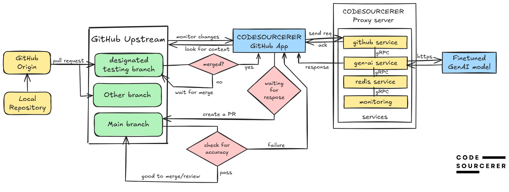

<!-- Badges -->
[![Last Commit][last-commit-shield]][last-commit-url]
[![Issues][issues-shield]][issues-url]
[![License][license-shield]][license-url]
[![Top Language][top-language-shield]][top-language-url]
<!-- [![Contributors][contributors-shield]][contributors-url] -->
<!-- [![Forks][forks-shield]][forks-url] -->
<!-- [![Stargazers][stars-shield]][stars-url] -->
<!-- [![Total Commits][total-commits-shield]][total-commits-url] -->
<!-- [![Pull Requests][pull-requests-shield]][pull-requests-url] -->

<br>
<div align="center">
  <div align="center">
    <picture>
      <source srcset="https://github.com/user-attachments/assets/32f0cd5f-9774-4af8-84b6-746ff03f74de" media="(prefers-color-scheme: dark)" style="filter: invert(1);" />
      
    </picture>
  </div>


<br>
  <h3 align="center">CODESOURCERER-bot</h3>

  <p align="center">
    AI-powered tool for automated test generation in CI pipeline
    <br />
    <a href="https://github.com/puneeth072003/CODESOURCERER/"><strong>Explore the repo »</strong></a>
    <br />
    <br />
    <a href="https://codesourcerer.webflow.io">View Website</a>
    &middot;
    <a href="https://github.com/puneeth072003/CODESOURCERER/issues/new?labels=bug&template=bug-report---.md">Report Bug</a>
    &middot;
    <a href="https://github.com/puneeth072003/CODESOURCERER/issues/new?labels=enhancement&template=feature-request---.md">Request Feature</a>
  </p>
</div>


<!-- TABLE OF CONTENTS -->
<details>
  <summary>Table of Contents</summary>
  <ol>
    <li>
      <a href="#about-the-project">About The Project</a>
      <ul>
        <li><a href="#built-with">Built With</a></li>
      </ul>
    </li>
    <li>
      <a href="#getting-started">Getting Started</a>
      <ul>
        <li><a href="#prerequisites">Prerequisites</a></li>
        <li><a href="#Setup Instructions">Setup Instructions</a></li>
      </ul>
    </li>
    <li><a href="#usage">Usage</a></li>
    <li><a href="#roadmap">Roadmap</a></li>
    <li><a href="#contributing">Contributing</a></li>
    <li><a href="#license">License</a></li>
    <li><a href="#contact">Contact</a></li>
    <li><a href="#acknowledgments">Acknowledgments</a></li>
  </ol>
</details>


## About The Project

<center>
  <video width="600" autoplay loop muted>
    <source src="./docs/assets/CS-demo.mp4" type="video/mp4">
    Your browser does not support the video tag.
  </video>
</center>

Our tool seamlessly integrates with GitHub to automate test generation for code changes. It detects modifications in your repository, sends requests to a proxy server, and interacts with a Generative AI API to generate relevant tests. These tests are automatically added alongside the developer’s changes and merged into the main branch.

*For a detailed workflow explanation, see below.*

### Workflow



</br>
The above image illustrates the working of CODESOURCERER in a GitHub-based development pipeline

#### Glossary
- **designated testing branch**: A branch solely designated for our tool. It is the root branch from which changes are detected and tests are generated.
- **proxy server**: Built using a microservices architecture, it is responsible for hosting all business logic.
- **github app**: Acts as a middleman authorized in your repository to view code changes and raise PRs.

  ***Note:** A PR is raised from a sandbox branch following the naming convention `CS-Sandbox-<hash>`.*


### Built With

This section lists the major frameworks and libraries used to bootstrap this tool.

*   
*   
*   
*   
*   


<!-- GETTING STARTED -->
## Getting Started

Follow these steps to set up the development environment for **CODESOURCERER**.

### Prerequisites

Ensure you have the following installed:

- **Go** (latest version)  
- **Air** (for hot-reloading)  
- **Ngrok** (for tunneling local services)  

### Setup Instructions

#### 1. Fork and Clone the Repository  
Fork the repository and then clone your forked version:  
   ```sh
   git clone https://github.com/puneeth072003/CODESOURCERER.git
  ```
Change into the project directory:

```sh
cd CODESOURCERER
```
#### 2. Sync Dependencies
Run the following in the project root to set up Go modules:

```sh
go work sync
```
#### 3. Install Dependencies for Individual Services
Navigate to the respective service directories and install dependencies:

```sh
cd services/gen-ai
go mod tidy
cd services/github
go mod tidy
```
#### 4. Configure Environment Variables
Each service requires an `.env` file. Use the example .env files provided in the respective directories to configure your environment.

#### 5. Install and Run Air for Hot Reloading
```sh
cd services/gen-ai
air
```
Open a new terminal and run the GitHub service:

```sh
cd services/github
air
```
#### 6. Setup Ngrok for Local Webhook Development
Expose port 3000 using Ngrok:

```sh
ngrok http 3000
```
*Note: Copy the generated Ngrok URL.*

#### 7. Configure GitHub App for Local Development
For development purposes, we recommend creating your own GitHub App with all necessary permissions. Update the webhook callback URL in this format:

```bash
<ngrok-url>/webhook
```
Now your development environment is set up and ready to go! 🚀


<!-- USAGE EXAMPLES -->
## Usage

We are currently working on comprehensive documentation covering various use cases. Stay tuned for updates!  

In the meantime, feel free to explore the project and check back soon for detailed usage examples.

<!-- ROADMAP -->
## Roadmap

For the latest progress and advancements of the project, check out the [Project Board](https://github.com/users/puneeth072003/projects/3).  

See the [open issues](https://github.com/puneeth072003/CODESOURCERER/issues) for a full list of proposed features and known issues.


<!-- CONTRIBUTING -->
## Contributing

Contributions help improve this project and make it more robust. Any contributions you make are **greatly appreciated**.

If you have a suggestion to enhance the project, feel free to fork the repository and open a pull request. You can also create an issue with the tag `"enhancement"`. Don't forget to give the project a ⭐!  

### Contribution Workflow  

1. **Fork the repository**  
2. **Create a new branch** (`git checkout -b feature/<feature_name>`)
3. **Commit your Changes** (`git commit -m 'feat <issue_no>: breif description of commit`)
4. **Push to the Branch** (`git push origin feature/<feature_name>`)
5. **Open a Pull Request**

### Top contributors:

<a href="https://github.com/puneeth072003/CODESOURCERER/graphs/contributors">
  
</a>


<!-- LICENSE -->
## License

Distributed under the MIT License. See [`LICENSE.txt`](LICENSE.txt) for more information.


<!-- CONTACT -->
## Contact

- Dev team:  codesourcerer.org@gmail.com
- Youtube Link: [@Codesourcerer-bot](https://www.youtube.com/channel/UCas0TjQ_Hueh8DACnGhPcEQ)
- Project Link: [https://github.com/puneeth072003/CODESOURCERER](https://github.com/puneeth072003/CODESOURCERER)


<!-- ACKNOWLEDGMENTS -->
## Acknowledgments

This section lists research papers that have contributed to this project.

* [1] Boyang Du, Sarah Azimi, Annarita Moramarco, Davide Sabena, Filippo Parisi, and Luca Sterpone,  
   *"An Automated Continuous Integration Multitest Platform for Automotive Systems"*,  
   IEEE International Conference on Design, Automation & Test in Europe (DATE), 2021.  
   [Link](https://ieeexplore.ieee.org/document/9425022/)

* [2] N. Tillmann and W. Schulte,  
   *"Parameterized Unit Tests"*, IEEE Transactions on Software Engineering, 2010.  
   [Link](https://dl.acm.org/doi/10.1145/1081706.1081749)

* [3] G. Fraser and A. Arcuri,  
   *"EvoSuite: Automatic Test Suite Generation for Object-Oriented Software"*,  
   ACM Transactions on Software Engineering and Methodology (TOSEM), 2014.  
   [Link](https://dl.acm.org/doi/10.1145/2642937)

* [4] M. Grechanik, Q. Xie, and C. Fu,  
   *"Automatically Finding Performance Problems with Feedback-Directed Learning Software Testing"*,  
   IEEE International Conference on Software Engineering, 2012.  
   [Link](https://ieeexplore.ieee.org/document/6222590)


<!-- Badge References -->
[last-commit-shield]: https://img.shields.io/github/last-commit/puneeth072003/CODESOURCERER?style=for-the-badge
[last-commit-url]: https://github.com/puneeth072003/CODESOURCERER/commits/main

[total-commits-shield]: https://img.shields.io/github/commit-activity/y/puneeth072003/CODESOURCERER?style=for-the-badge
[total-commits-url]: https://github.com/puneeth072003/CODESOURCERER/commits/main

[issues-shield]: https://img.shields.io/github/issues/puneeth072003/CODESOURCERER.svg?style=for-the-badge
[issues-url]: https://github.com/puneeth072003/CODESOURCERER/issues

[pull-requests-shield]: https://img.shields.io/github/issues-pr/puneeth072003/CODESOURCERER?style=for-the-badge
[pull-requests-url]: https://github.com/puneeth072003/CODESOURCERER/pulls

[license-shield]: https://img.shields.io/github/license/puneeth072003/CODESOURCERER.svg?style=for-the-badge
[license-url]: https://github.com/puneeth072003/CODESOURCERER/blob/main/LICENSE

[top-language-shield]: https://img.shields.io/github/languages/top/puneeth072003/CODESOURCERER?style=for-the-badge
[top-language-url]: https://github.com/puneeth072003/CODESOURCERER
